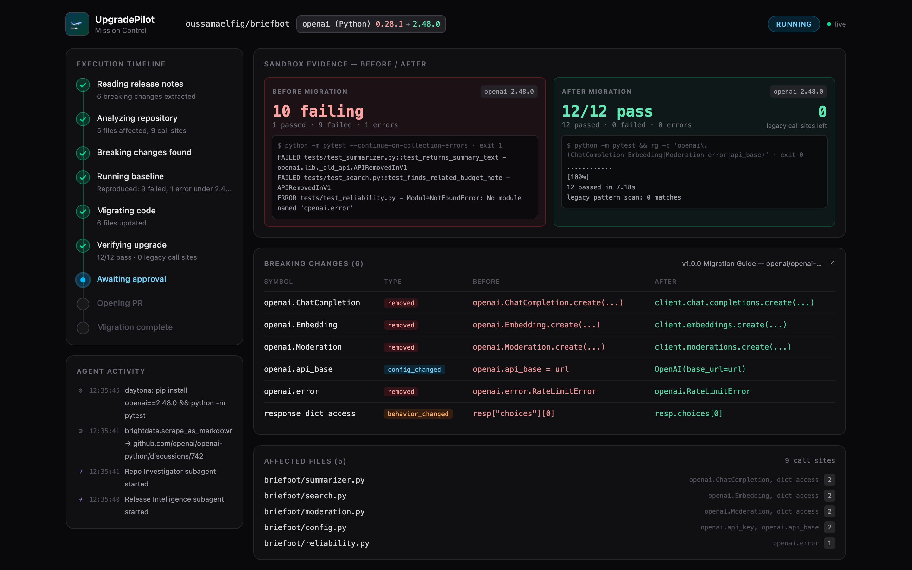
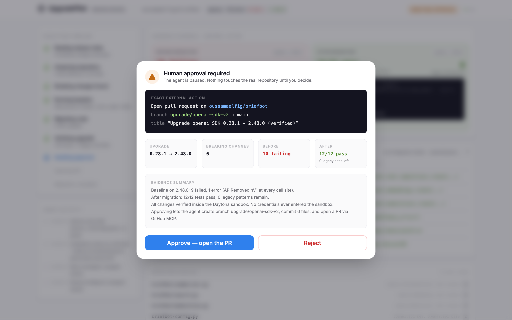
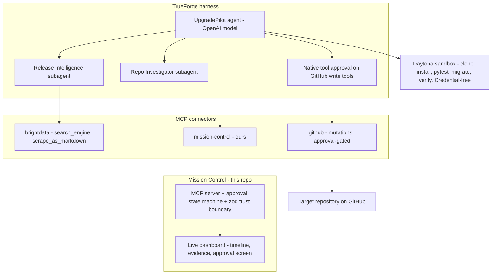

# UpgradePilot

### From breaking change to verified PR.

UpgradePilot is an autonomous dependency-migration agent built on the
[TrueForge](https://github.com/truefoundry/trueforge) agent harness. Point it at a repository
and an upgrade target:

> "Upgrade this project to the current OpenAI SDK. Read the official migration documentation,
> reproduce what breaks, migrate the code, prove the tests pass, and ask me before touching the
> real repository."

It does not produce a migration checklist. It performs the migration, proves the upgraded
software works with executed tests, and asks permission before opening the real PR.

```text
Docs change
   ↓
UpgradePilot understands the migration      Bright Data MCP → live official docs, schema-validated
   ↓
Finds affected code                          parallel subagents map breaking changes to call sites
   ↓
Migrates in a sandbox                        Daytona — credential-free isolation
   ↓
Proves the new version works                 pytest before/after + deterministic legacy-pattern scan
   ↓
Asks permission                              human approval, enforced at the harness tool boundary
   ↓
Opens the PR                                 GitHub MCP — the only path to the real world
```





## The demo migration

**`openai` 0.28.1 → current SDK (v1 client interface)** on
[oussamaelfig/briefbot](https://github.com/oussamaelfig/briefbot), a small meeting-notes app
frozen in 2023: module-level `openai.ChatCompletion/Embedding/Moderation` calls, `openai.api_base`
config, dict-style response access, and the removed `openai.error` taxonomy.

Its test suite is fully offline — a local stub implements the OpenAI REST endpoints and the app
targets it via base-URL override — so the *same* tests grade both sides of the migration:

| State | Result (validated in a real Daytona sandbox) |
| --- | --- |
| `openai==0.28.1` + original code | **13 passed** |
| current SDK + original code | **9 failed, 1 passed, 1 error** — `APIRemovedInV1` at every call site |
| current SDK + correct migration | **13 passed**, legacy-pattern scan: **0 matches** |

Verification is never an LLM claim: it is pytest exit codes and a deterministic pattern scan,
executed in the sandbox, reported with raw log excerpts.

## Architecture



### How each sponsor capability does real work

- **TrueForge** runs the whole loop: the agent, two parallel **dynamic subagents** with isolated
  contexts (Release Intelligence, Repo Investigator), **sandbox-as-tool** execution on Daytona,
  git-backed **skills** with progressive disclosure, persistent sessions, and **native tool
  approval** on GitHub write tools — the harness itself pauses before anything irreversible.
- **Bright Data MCP** feeds the agent live official migration documentation
  (`scrape_as_markdown`, `search_engine`). The pipeline is declarative and version-controlled:
  [`skills/release-intel/sources.yaml`](skills/release-intel/sources.yaml) registers sources, a
  **publisher allowlist** (provenance, not just domain), a recovery query, and the extraction
  schema; [`.cursor/rules/brightdata-pipeline.mdc`](.cursor/rules/brightdata-pipeline.mdc)
  mirrors it as a project rule. When a source drifts, the skill's fallback chain re-acquires the
  docs from the next allowed source and the dashboard shows a `RECOVERED SOURCE` badge — data
  provenance stays visible.
- **Daytona** executes everything that touches code: clone, installs, baseline reproduction,
  migration edits, verification. The sandbox is **credential-free** — the only path from agent to
  the real world is the approval-gated GitHub MCP.
- **OpenAI** is the model layer for the agent and both subagents.
- **Qodo** reviewed every PR in this repository — see the evidence below.

### Mission Control (this repository's code)

The dashboard is itself an MCP server. The agent reports structured progress and evidence
through ordinary tool calls (`start_mission`, `report_breaking_changes`, `report_baseline`,
`report_verification`, `request_approval`, `await_approval`, …) — no harness internals scraped.
Two properties matter:

1. **Model output is untrusted input.** Every payload crosses a zod trust boundary; malformed
   reports are rejected with structured errors the agent can self-correct from.
2. **The approval state machine is deterministic.** Approvals resolve exactly once;
   `report_pr_opened` is rejected unless the recorded PR matches the approved action (branch +
   repository), so approval for one PR can never launder a different one into the audit state;
   an approval from mission A can never satisfy mission B. All of it regression-tested.

## Human approval model

Defense in depth, both layers real:

- **Product gate** — the agent calls `request_approval` with the exact external action and the
  before/after evidence; Mission Control renders the approval screen; `await_approval` blocks
  until the human decides. Rejection ends the mission.
- **Harness gate** — GitHub MCP write tools carry TrueForge's native
  `require_approval_for_tools: ["@write", "@destructive"]`, so even a misbehaving agent cannot
  mutate the repository without a human clicking through the harness approval.

## Running it

Prereqs: Node 22+, a TrueForge instance (`npx @truefoundry/trueforge`), and API keys for
OpenAI, Daytona, Bright Data, plus a fine-grained GitHub PAT (Contents + Pull requests,
read/write) for the target repository.

```bash
# 1. Mission Control (dashboard + MCP server on http://127.0.0.1:4100)
cd mission-control && npm run setup && npm start

# 2. Wire TrueForge (model, Daytona, the three MCP connectors, both skills, the agent)
#    — full click-by-click / API instructions:
open agent/setup.md

# 3. Open a session with the upgradepilot agent and ask for an upgrade; watch
#    http://127.0.0.1:4100 light up.
```

Tests:

```bash
cd mission-control && npm test        # server (34) + web (4)
cd demo-target && pip install -r requirements.txt && python -m pytest   # fixture (13)
```

## Qodo Code Review Evidence

Every meaningful change in this repository went through a Qodo-reviewed PR before merge —
implement → review → respond point-by-point → fix with regression tests → re-review → merge.
Qodo was not a checkbox; it materially changed this codebase.

Representative merged PRs (full review trails preserved):

- [#3 Mission Control server](https://github.com/oussamaelfig/UpgradePilot/pull/3) — **the
  strongest cycle**: two full review rounds, 7 findings, 7 applied, 7 regression tests. Best
  catch: `report_pr_opened` accepted *any* approved approval, so approval of one PR could have
  laundered a different PR into the audit state — exactly the class of bug this component exists
  to prevent. Qodo then re-reviewed the fixes and found two follow-up bugs *in them* (half-loaded
  corrupt snapshots; ahead-of-store replay gaps), both fixed and tested.
- [#1 Engineering standards](https://github.com/oussamaelfig/UpgradePilot/pull/1) — Qodo reviewed
  its own review rules and found a High-severity supply-chain hole: the docs-recovery path
  accepted any `site:github.com` result as "official". Fixed with an explicit publisher
  allowlist; one finding declined with live-endpoint evidence and verified stale on re-review.
- [#2 briefbot demo fixture](https://github.com/oussamaelfig/UpgradePilot/pull/2) — retry-policy
  gaps (transport errors escaping retries) fixed with regression tests; re-review clean.
- [#4 Mission Control dashboard](https://github.com/oussamaelfig/UpgradePilot/pull/4) — a real
  stale-response race that could hide the approval modal, caught before it ever hit a demo;
  status derivation moved server-side because Qodo enforced *this repo's own* standards file.
- [#5 Agent skills](https://github.com/oussamaelfig/UpgradePilot/pull/5) — baseline-pass
  short-circuit bypassing the legacy scan; requested-target-version handling; dict-style response
  access added to the scan; a schema-drift contract test added on request.

Each PR ends with a **Qodo engagement log** table classifying every finding
(APPLIED / DECLINED WITH REASONING / FOLLOW-UP / STALE) with commits and regression tests.

## Repository layout

- `mission-control/` — MCP server, approval state machine, zod schemas, SSE API, React dashboard
- `skills/` — git-backed TrueForge skills: `release-intel` (Bright Data pipeline + registry + schema), `openai-v1-migration` (deterministic sandbox playbook)
- `agent/` — the UpgradePilot agent definition (system prompt) and TrueForge setup guide
- `demo-target/` — source of the briefbot fixture (published to its own repo for live runs)
- `best_practices.md`, `.pr_agent.toml`, `.cursor/rules/` — the standards Qodo enforces here
