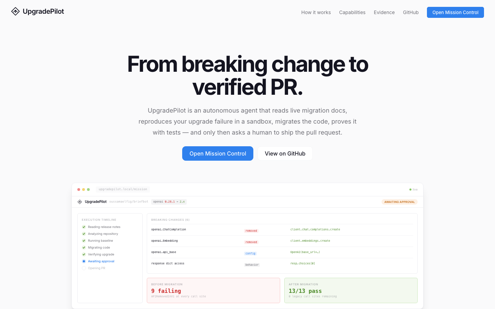
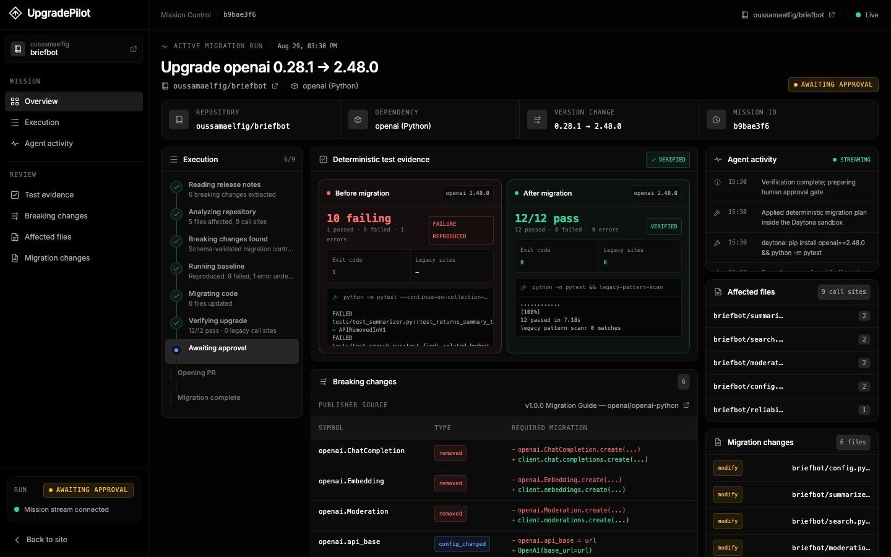
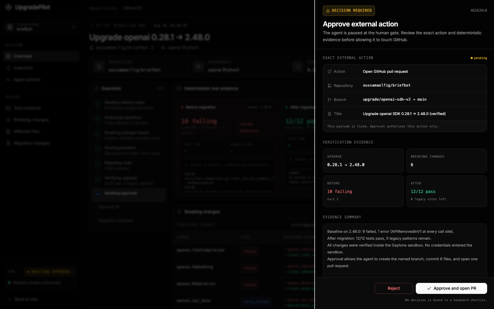
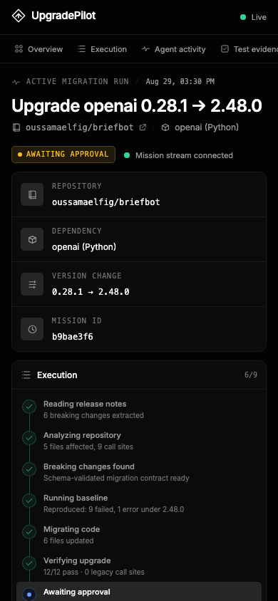
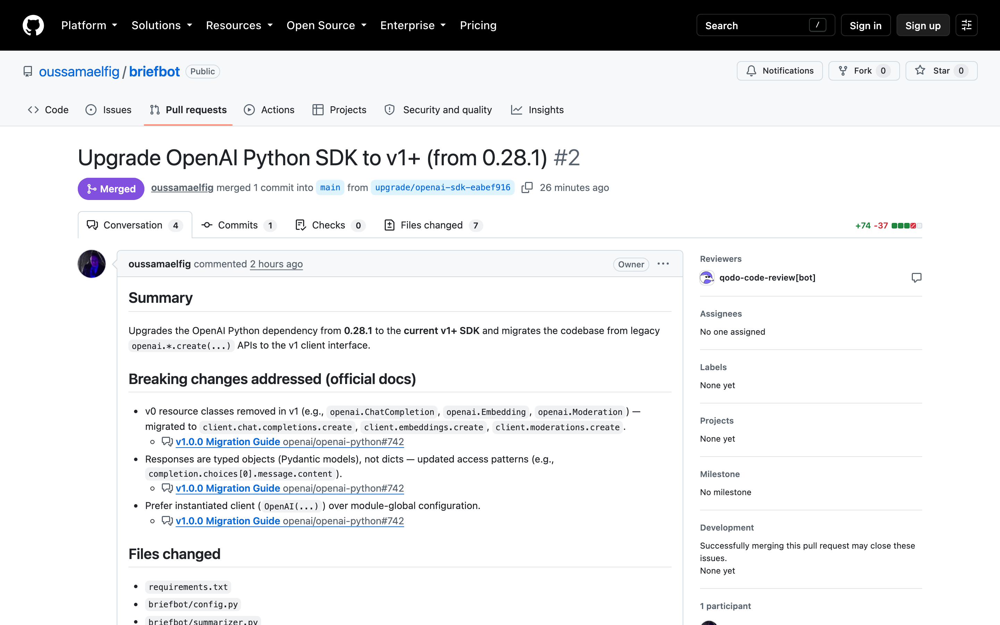
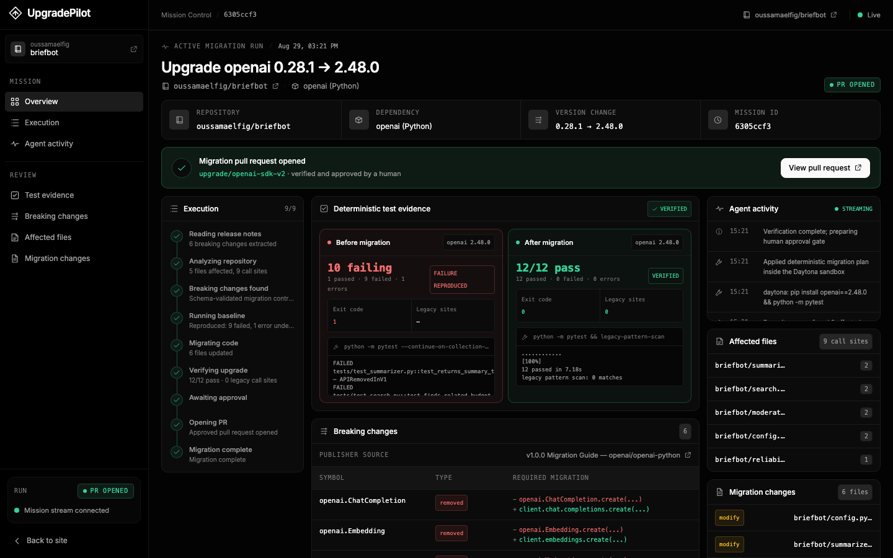

# From breaking change to verified PR: building UpgradePilot in one hackathon day

*Field report from the Agent Harness Hackathon, San Francisco — August 29, 2026. Built in one day on TrueFoundry's TrueForge harness, with Bright Data, Daytona, Qodo, and OpenAI doing load-bearing work.*

## The shaped hole

Every AI engineer in the room lived through the same week in 2023: `openai>=1.0` shipped, and every `openai.ChatCompletion.create` in production started throwing `APIRemovedInV1`. The fix was never intellectually hard — the migration guide existed. The cost was toil: read the docs, find every call site, upgrade, run the tests, open the PR, convince a reviewer you didn't miss anything.

We picked that exact migration for three reasons.

First, the hackathon's bar was explicit: *perform the work, don't explain it*. Nobody wants a chatbot that summarizes a migration guide; they want the verified PR.

Second, honesty by construction. The v1 breakage is deterministic — install the new SDK against old code and it fails at every call site, offline, with zero API keys. Our demo target ([briefbot](https://github.com/oussamaelfig/briefbot), a meeting-notes app frozen in 2023) runs its whole suite against a local stub server, so the *same* tests grade both sides of the migration. The evidence is pytest exit codes; it can't be faked.

Third, the kicker: the demo migrates a sponsor's own SDK.

## What UpgradePilot does

Input is one sentence:

> "Upgrade this project to the current OpenAI SDK. Read the official migration documentation, reproduce what breaks, migrate the code, prove the tests pass, and ask me before touching the real repository."

From there:

1. **Understand** — a Release Intelligence subagent pulls the official migration guide live through Bright Data and extracts breaking changes into a schema-validated contract, every entry citing its official source URL.
2. **Locate** — a parallel Repo Investigator subagent maps those changes to actual call sites.
3. **Reproduce** — in a Daytona sandbox: install the new SDK against the unmodified code and watch the suite burn. **9 failed, 1 error** — `APIRemovedInV1` at every call site.
4. **Migrate** — the smallest correct change set (seven files on briefbot).
5. **Verify** — full suite re-run (**13/13 passed**) plus a deterministic scan for leftover legacy patterns (**0 matches**). Exit codes, not model claims — the raw command output is quoted in the [produced PR's body](https://github.com/oussamaelfig/briefbot/pull/2).
6. **Ask** — stop. Show a human the exact GitHub action and the before/after evidence. Wait.
7. **Act** — only after approval: branch, commit, real pull request through the GitHub MCP.

*Mission Control mid-run, paused at the human gate. (Dashboard shots in this post come from a seeded preview mission used during UI work; the live run's numbers are quoted in the PR below.)*

## TrueForge: the agent loop we didn't have to build

The honest review of the harness is a list of things we never wrote: the agent loop, subagent orchestration, context management, approval UX, session persistence. TrueForge ran all of it. Three MCP connectors (Bright Data, GitHub, our own Mission Control), Daytona as sandbox-as-tool, parallel dynamic subagents with isolated contexts, and git-backed skills with progressive disclosure — only name and description in context, bodies read on demand.

Context economics paid rent too: deferred tool loading kept all 44 GitHub tool schemas out of the context window until first use, and the large scraped migration guide was offloaded to a sandbox file with a preview left in context. Sessions persist server-side, which became a demo beat: hard-refresh both tabs mid-run and everything comes back, the dashboard replaying its event log.

The design decision we're proudest of: **the dashboard is itself an MCP server.** Mission Control exposes eleven tools (`start_mission`, `report_baseline`, `request_approval`, `await_approval`, …), and the agent drives the UI through ordinary tool calls. No harness internals scraped, no narrator LLM. Model output is untrusted input, so every payload crosses a zod trust boundary; malformed reports bounce with structured errors the agent can self-correct from.

Approval is defense in depth, and both layers are real. Our state machine guarantees an approval resolves exactly once, is scoped to its mission, and that a recorded PR must *match* the approved action (branch and repository). Underneath it, TrueForge's native tool gate holds GitHub write tools behind `require_approval_for_tools: ["@write", "@destructive"]` — even a misbehaving agent can't talk its way past the harness. The only path from agent to the real world runs through a human click.

*The approval sheet. The payload is fixed — approval authorizes this action only.*

*The console holds up at phone width.*

## Bright Data: live docs, provenance enforced

Migration guidance comes from live official documentation via the Bright Data MCP (`scrape_as_markdown` for known URLs, `search_engine` for recovery). What makes it an engineering artifact rather than a scrape script is the registry: `skills/release-intel/sources.yaml` version-controls the source list in priority order, a **publisher allowlist**, a recovery query, and the extraction schema.

The allowlist is the point: `github.com` is shared hosting, so a domain match proves nothing. Authenticity requires the owner segment (`github.com/openai/...`), and recovery results that don't match are discarded regardless of ranking. When a source drifts — failed scrape, thin content, failed schema validation — the skill falls through the registered fallbacks, then recovery search, and the dashboard shows a `RECOVERED SOURCE` badge. The pipeline lives inside the agentic workflow as a skill and a project rule, not beside it as a script.

## Daytona: every claim is an executed command

Everything that touches code happens in a Daytona sandbox driven through TrueForge's sandbox-as-tool: clone, virtualenv, installs, baseline reproduction, migration edits, verification. The evidence rule is absolute: every number on the dashboard comes from executed command output, raw log excerpts attached.

The security property is just as load-bearing: the sandbox is credential-free. No GitHub token, no API keys (the fixture's tests run against a local stub). Prompt injection from scraped docs or a confused agent can't reach the real world from inside the sandbox — the only mutation path is the approval-gated GitHub MCP.

The sandbox was also our best regression tool during development — twice it caught us about to quietly break the demo. More below.

## Qodo: a second engineer, not a checkbox

Every one of the ten PRs in this repo went through review → point-by-point challenge → fix with regression tests → re-review. Three catches worth naming:

- **A supply-chain hole in our own rules (PR #1, High).** Our docs-recovery search accepted any `site:github.com` result as "official." Schema validation checks shape, not provenance. Fixed with the publisher allowlist — before any feature code existed.
- **Approval laundering (PR #3).** `report_pr_opened` originally required *an* approved approval — not that the recorded PR *was the approved one*. Approve PR A, record PR B. The guard now matches branch and repository, with regression tests. That cycle ran two full rounds — 7 findings, 7 applied, 7 regression tests — and the re-review found two further bugs *in our fixes*.
- **The focus leak inside its own fix (PR #8).** An earlier round had us harden the approval modal's focus trap. One cycle later Qodo flagged that while a decision is in flight both buttons are disabled, the focusables query returns empty, and Tab escapes the modal — a correctness bug inside the very behavior it had asked for. Fixed and re-verified.

We also declined findings with evidence, on the record: when Qodo claimed our batch scrape tools were unavailable, we ran `tools/list` against the live connector, posted the output, and merged with the decline recorded.

## OpenAI: the model, and the punchline

The root agent and both subagents run on `gpt-5.2`. The work is structure-heavy — schema-valid extraction, exact sandbox command sequences, tool discipline across a seven-stage protocol — and the model held it across a full autonomous mission. And the poetry writes itself: OpenAI models migrating OpenAI's own SDK from OpenAI's own migration guide.

## What broke along the way

- **The SDK moved under us.** `pip install --upgrade openai` in the sandbox resolved 3.6.0, which depends on `httpx2` — not `httpx` — and our reference migration's tests, which constructed v1-style exceptions with an `httpx.Request`, broke. The durable fix: construct SDK exceptions with `request=None` so tests don't care which HTTP library the SDK drags in. Validated in a live sandbox before the demo depended on it.
- **Our own fix broke the demo's soul.** Responding to a Qodo finding about `api_base` restore semantics, our first patch read `openai.api_base` at import time — which turned the iconic call-time `APIRemovedInV1` failures into a wall of import-time `AttributeError`s. The demo's *failure signature* is a feature. Caught by re-running the sandbox validation protocol; `getattr` with a default preserved both behaviors.
- **GitHub closed our stacked PR for us.** PR #4 was stacked on PR #3's branch. Merging #3 deleted that branch, and GitHub closed #4 one second later (`base_ref_deleted` → `closed`, per the event log). Reopen, retarget to `main`, merge. Lesson: retarget stacked PRs before deleting their base.
- **The read-only PAT.** The fine-grained GitHub token behind the connector was minted read-only — fine-grained PATs default that way per permission — so every discovery call worked and the first write didn't. Re-minted with Contents + Pull requests read/write; the README now spells out the exact scopes.
- **Subagents hijacked the dashboard.** In the first end-to-end attempt, subagents called `start_mission` themselves and littered Mission Control with junk missions. The agent definition now reserves mission lifecycle for the root agent; subagents receive the `mission_id` and report only their own evidence.
- **The agent gave up at the finish line.** `await_approval` returned `pending`; the agent treated that as terminal and ended its turn instead of polling — a completed migration, stalled at the gate. Instructions now mandate the poll loop until a human decision, with no external actions while pending.

Every one of these was a real failure observed in live runs or event logs, and each fix is a commit you can read.

## The numbers

- **Ten PRs** ([#1–#10](https://github.com/oussamaelfig/UpgradePilot/pulls?q=is%3Apr)): seven merged, three open at time of writing (docs and two UI restyles). Every PR carries a **Qodo engagement log** classifying each finding — applied, declined with reasoning, or verified stale — with commits and regression tests.
- **About fifty findings** evaluated on the record across those logs; most applied with regression tests, a handful declined with evidence.
- **Test growth as a side effect of review:** mission-control server suite 21 → 38 (PR #3's two review rounds alone took it 21 → 30); web suite 6 → 26 across the UI and hardening PRs; the demo fixture holds 13. (Executed at merge time: server 38 passed, web 26 passed.)
- **The artifact:** [briefbot PR #2](https://github.com/oussamaelfig/briefbot/pull/2), opened autonomously after human approval — and since merged. Its body quotes the executed evidence: baseline exit 1 (9 failed, 1 error, 1 passed on `openai==3.6.0`), post-migration exit 0 (13 passed), legacy-pattern scan 0 matches, all inside a credential-free sandbox.

*The proof: a real PR with baseline and verification evidence in the body — reviewed, then merged.*

*Mission Control at the end of a run: nine of nine stages, approval recorded, pull request opened.*

## What we'd build next

The architecture already generalizes: `sources.yaml` registers documentation sources and allowlists *per package*, and each migration is a playbook skill. Supporting the next dependency means a registry entry and a playbook — the agent, mission protocol, approval model, and dashboard don't change. Beyond that: triggering missions from release feeds instead of prompts, and letting the deterministic legacy scan gate CI so a migration PR can't merge with a stale call site.

The software didn't say it worked. It proved it, and then it asked.

---

*UpgradePilot: [github.com/oussamaelfig/UpgradePilot](https://github.com/oussamaelfig/UpgradePilot) · the autonomous run's PR: [briefbot#2](https://github.com/oussamaelfig/briefbot/pull/2) · every PR's Qodo review → response → re-review trail is public in the repo, engagement log included.*
